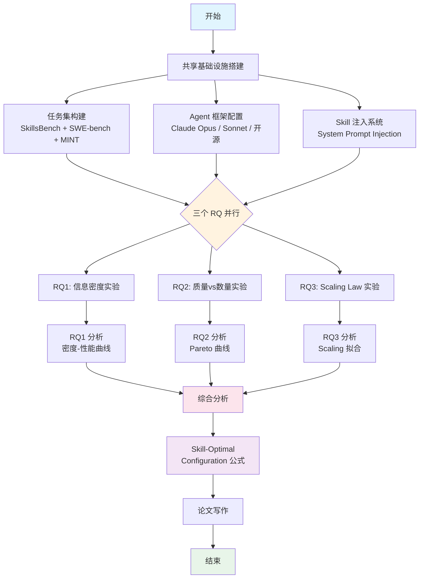
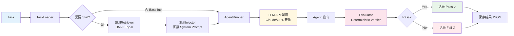
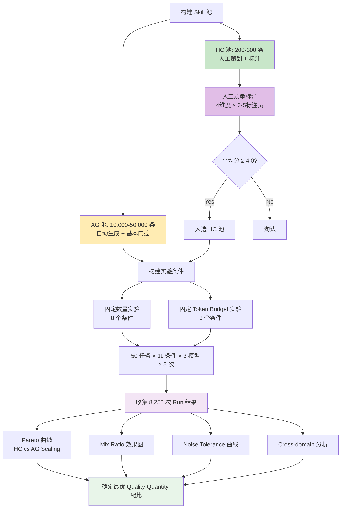
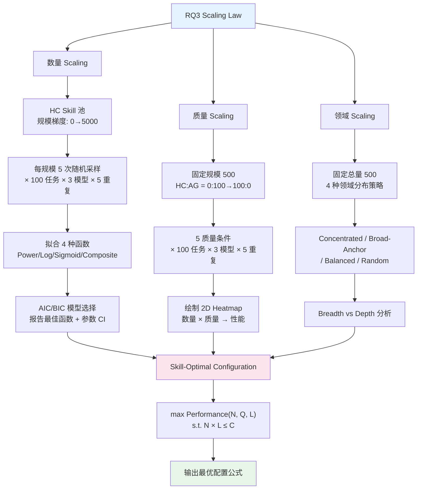
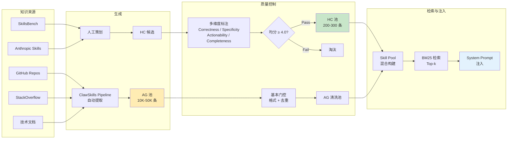
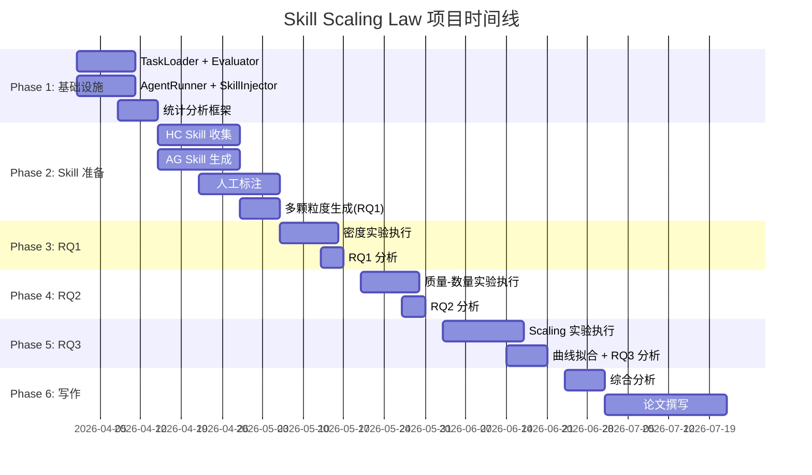

# 流程图

## 1. 总体实验 Pipeline



## 2. 单次 Agent Run 执行流程



## 3. RQ1：信息密度实验流程

```mermaid
graph TD
    A[选择 50 个任务] --> B[提取每个任务的核心知识]
    B --> C[用 LLM 生成 5 级颗粒度 Skill]

    C --> C1[L1: One-liner ~50 tok]
    C --> C2[L2: Checklist ~200 tok]
    C --> C3[L3: Focused SOP ~500 tok]
    C --> C4[L4: Comprehensive ~1500 tok]
    C --> C5[L5: Documentation ~3000+ tok]

    C1 --> D[验证包含关系<br/>L(n+1) ⊃ L(n)]
    C2 --> D
    C3 --> D
    C4 --> D
    C5 --> D

    D --> E[50 任务 × 6 条件 × 3 模型 × 5 次]
    E --> F[收集 4,500 次 Run 结果]

    F --> G1[绘制 Token-Performance 曲线]
    F --> G2[按难度分组分析]
    F --> G3[按领域分组分析]
    F --> G4[计算信息效率 Δrate/Δtok]

    G1 --> H[确定最优颗粒度]
    G2 --> H
    G3 --> H
    G4 --> H

    H --> I[输出：最优 ~500 tokens 的量化证据]

    style A fill:#e3f2fd
    style D fill:#fff3e0
    style F fill:#f3e5f5
    style I fill:#e8f5e9
```

## 4. RQ2：质量 vs 数量实验流程



## 5. RQ3：Scaling Law 实验流程



## 6. Skill 生命周期



## 7. 统计分析 Pipeline

```mermaid
graph TD
    A[原始结果 JSON] --> B[加载与聚合]
    B --> C[按条件分组计算 Pass Rate]

    C --> D1[效果量<br/>Cohen's d]
    C --> D2[显著性检验<br/>Wilcoxon / Bootstrap]
    C --> D3[置信区间<br/>95% Bootstrap CI]

    D1 --> E[统计报告表]
    D2 --> E
    D3 --> E

    C --> F{RQ3?}
    F -->|是| G[曲线拟合]
    G --> G1[Power Law: a·N^α + b]
    G --> G2[Logarithmic: a·log N + b]
    G --> G3[Sigmoid: L/(1+e^-k·N-N₀)]
    G1 --> H[AIC/BIC 模型选择]
    G2 --> H
    G3 --> H
    H --> I[最佳拟合函数 + 参数 CI]

    E --> J[可视化]
    I --> J
    J --> K[论文级图表输出]

    style A fill:#e3f2fd
    style E fill:#fff3e0
    style I fill:#f3e5f5
    style K fill:#e8f5e9
```

## 8. 项目时间线


